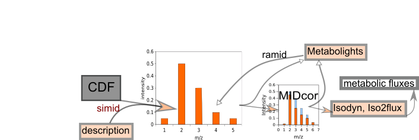

# container-cdf2mid
R-program to read CDF files containing time course of mass spectra of 13C-labeled metabolites, and write the extracted spectra in a format appropriate for further analysis.



# cdf2mid
Version: 1.0

## Short description
R-program to read CDF files, created by mass spectrometry machine, and evaluate the mass spectra of 13C-labeled metabolites 

## Description

RaMID is a computer program designed to read the machine-generated files saved in netCDF format containing registered time course of m/z chromatograms. It evaluates the peaks of mass isotopomer distribution (MID) making them ready for further correction for natural isotope occurrence. To create the docker image the github repository "https://github.com/seliv55/RaMID" is used. 

RaMID reads the CDF files presented in the working directory, and then separates the time courses for selected m/z peaks corresponding to specific mass isotopomers; corrects baseline for each selected mz; choses the time points where the distribution of peaks is less contaminated by other compounds and thus is the most representative of the real analyzed distribution of mass isotopomers; evaluates this distribution, and saves it in files readable by MIDcor, a program, which performs the next step of analysis, i.e. correction of the RaMID spectra for natural isotope occurrence, which is necessary to perform a fluxomic analysis. Correction for H+ loss produced by electron impact, natural occurring isotopes, and peaks overlapping


## Key features

- Primary processing of 13C mass isotopomer data obtained with GCMS

## Functionality

- Preprocessing of raw data
- initiation of workflows

## Approaches

- Isotopic Labeling Analysis / 13C
    
## Instrument Data Types

- MS
- GC-MS

## Screenshots

- screenshot of input data (format Metabolights), output is the same format with one more column added: corrected mass spectrum


## Tool Authors

- [Vitaly Selivanov](https://github.com/seliv55) (Universitat de Barcelona)

## Container Contributors

- [Pablo Moreno](https://github.com/pcm32) 

## Website

- https://github.com/seliv55/RaMID

## Git Repository

- https://github.com/seliv55/RaMID

## Installation

RaMID is present on all PhenoMeNal Galaxy instances on deployed Cloud Research Environments, under the Fluxomics category in the tool bar to the left of the screen. No installation is needed hence on PhenoMeNal Cloud Research Environments.

For advanced Docker usage:

- Go to the directory where the dockerfile is.
- Create container from dockerfile:

```
docker build -t cdf2mid:0.1 .
```

Alternatively, pull from repo:

```
docker pull container-registry.phenomenal-h2020.eu/phnmnl/cdf2mid
```

## Usage Instructions

On a PhenoMeNal Cloud Research Environment, go to Fluxomics tool category, and then click on ramid, and fill the expected input files, then press Run. Additionally, the tool can be used as part of a workflow with Midcor, Iso2flux and the Escher-Fluxomics tools. On a PhenoMeNal deployed CRE you should find as well a Fluxomics Stationary workflow, which includes RaMID. 

- To run RaMID as a docker image created in the PhenoMeNal repository, execute
 
```
docker run -it -v $PWD:/data container-registry.phenomenal-h2020.eu/phnmnl/cdf2mid -i /data/metdata -o /data/cdf2midout.csv -z /data/wd
```
- To run cdf2mid as a docker image created locally:

```
docker run -it -v $PWD:/data cdf2mid:0.1 -i /data/metdata -o /data/cdf2midout.csv -z /data/wd
```
- run test1 using the data that are in the folder "..." in https://drive.google.com/drive/folders/0B1lAg6jyw6lvSlphUi1mdlUwUXM
 
```
docker run -it --entrypoint=runcdf2midTest1.sh cdf2mid:0.1 
```
 
## Publications

- 
